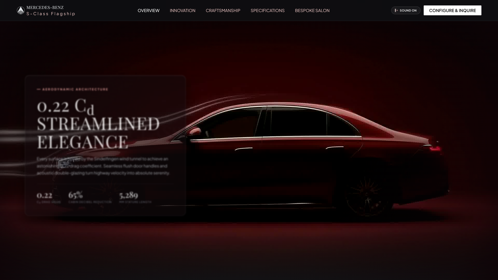
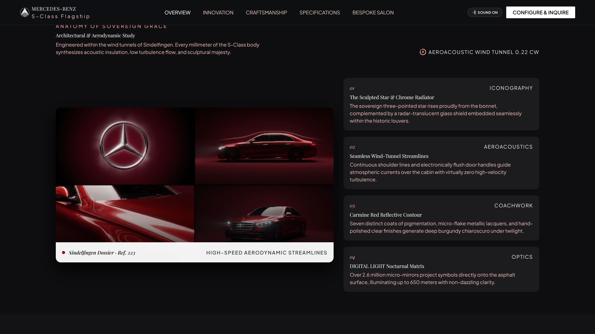
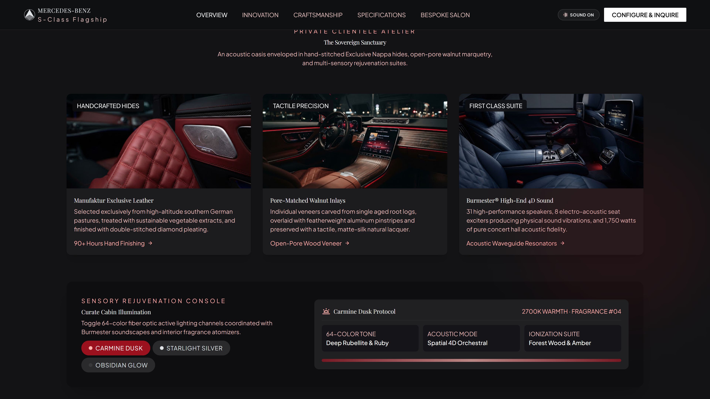
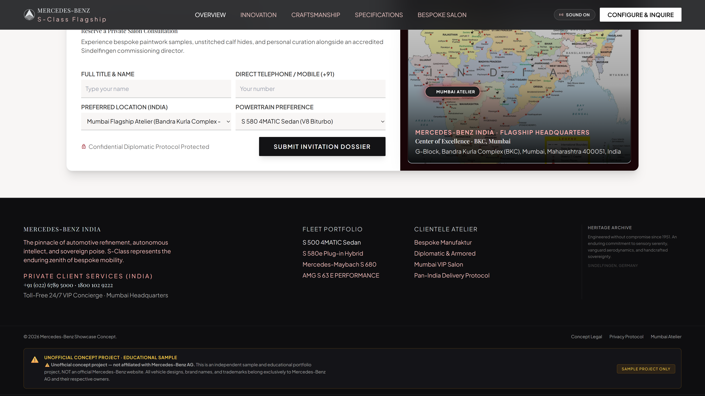

# Mercedes-Benz S-Class | 4K Ultra HD Experience

An editorial, cinematic web experience showcasing the **Mercedes-Benz S-Class Sedan (W223 Generation)**. Built with high-performance canvas frame super-sampling, bespoke typography, and seamless deployment readiness for Vercel.

---

## Features
- **4K Ultra HD Canvas Cinema Reel**: 237-frame master sequence running smoothly at 18 FPS with subpixel bicubic interpolation.
- **Zero Scroll Trap**: Smooth natural page flow across all sections.
- **Sensory Rejuvenation Console**: Interactive cabin illumination switcher (*Carmine Dusk*, *Starlight Silver*, *Obsidian Glow*).
- **Curated Specifications**: Comparative powertrain matrix (S 500 4MATIC vs S 580 4MATIC).
- **Mumbai Indian Atelier Integration**: Focused on Mumbai, Maharashtra with active radar pinpointing and +91 VIP concierge routing.
- **Deployment Ready**: Fully configured with `vercel.json` for one-click deployment on Vercel.

---

## Preview Gallery

| 4K Hero Showcase | Innovation & Aerodynamics |
| :---: | :---: |
|  |  |

| Interior Craftsmanship | Mumbai Atelier & Form |
| :---: | :---: |
|  |  |

---

## Deploy to Vercel
You can deploy this repository directly to Vercel:
1. Go to [Vercel](https://vercel.com) and click **Add New Project**.
2. Import your GitHub repository: `https://github.com/shahidmulanico/Mercedes-Benz.git`.
3. Leave all build settings as default (Framework Preset: **Other**).
4. Click **Deploy**.

---

## Local Development
To run locally without external dependencies:
```bash
# Start the local server
node server.js
```
Open [http://localhost:3000](http://localhost:3000) in your browser.

---

## Disclaimer & Credits
> ⚠️ **Unofficial Concept Project — Not Affiliated with Mercedes-Benz AG**  
> This website is an independent frontend concept and educational sample project created to demonstrate digital art, UI design, and interactive web animation. It is **NOT an official Mercedes-Benz website**. All vehicle designs, brand names, and trademarks belong exclusively to Mercedes-Benz AG and their respective owners.

- **Crafted with Precision by**: **Shahid Mulani**
- **GitHub**: [shahidmulanico](https://github.com/shahidmulanico)

